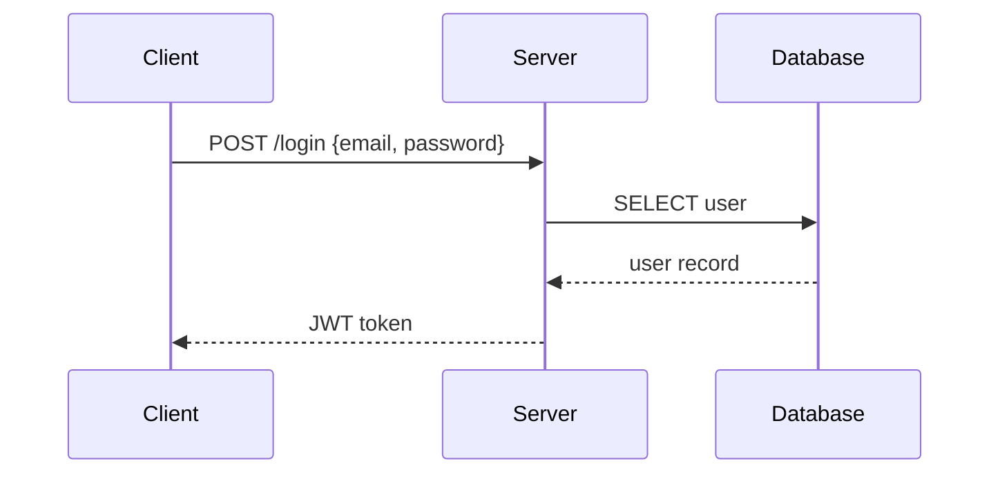
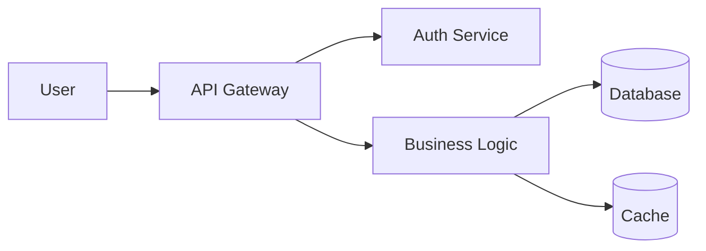
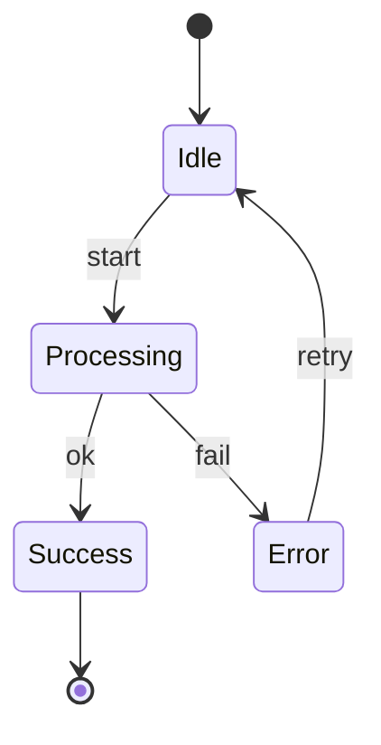

# Mermaid Diagrams

Generate `.mmd` text files and export to PNG/SVG/PDF using `mmdc` CLI or Kroki API.

**Key advantage:** Text-based syntax with fully automatic layout — no x/y coordinates needed.

## Chinese Font Rendering

Mermaid CLI (`mmdc`) uses headless Chromium for rendering. If Chinese characters render as tofu (□), you need to configure a CJK font family.

### Option A: Config file (recommended)

Create `mermaid-config.json` in the working directory:

```json
{
  "theme": "default",
  "fontFamily": "Microsoft YaHei, SimHei, Noto Sans SC, sans-serif"
}
```

Then export with:

```bash
mmdc -i diagram.mmd -o diagram.png -c mermaid-config.json
```

### Option B: Kroki API with font parameter

Kroki supports `?fontFamily=...` query parameter (Kroki v0.26+):

```bash
curl -s -X POST "https://kroki.io/mermaid/png?fontFamily=Noto+Sans+SC" \
  --data-binary @diagram.mmd -o diagram.png
```

### Verify available system fonts (Windows)

```powershell
[System.Drawing.Text.InstalledFontCollection]::new().Families | Where-Object { $_.Name -match 'YaHei|SimHei|SimSun|KaiTi|FangSong' } | ForEach-Object { $_.Name }
```

## Prerequisites

**Option A: Local (mmdc)**
```bash
npm install -g @mermaid-js/mermaid-cli
npx puppeteer browsers install chrome-headless-shell
mmdc --version
```

**Option B: Kroki API (no install)**
```bash
curl --version  # Just need curl
```

## Workflow

1. Check deps → `mmdc --version` or fall back to Kroki
2. Pick diagram type from table below
3. If chart contains CJK text, prepare font config (see Chinese Font Rendering above)
4. Generate `.mmd` file
5. Validate syntax before export
6. Export to PNG/SVG/PDF
7. Show to user, iterate

## Validation (Required)
```bash
# With mmdc
mmdc -i diagram.mmd -o /tmp/test.png 2>&1

# With Kroki (if mmdc unavailable)
curl -s -X POST -H "Content-Type: text/plain" --data-binary @diagram.mmd https://kroki.io/mermaid/svg -o /tmp/test.svg && echo "Valid" || echo "Invalid"
```

## Diagram Types

| Type | Keyword | Use for |
|------|---------|---------|
| Flowchart | `flowchart TD/LR` | processes, pipelines, decisions |
| Sequence | `sequenceDiagram` | API calls, message passing |
| Class | `classDiagram` | OOP models, data structures |
| ER | `erDiagram` | database schemas |
| State | `stateDiagram-v2` | state machines, lifecycle |
| Gantt | `gantt` | project timelines |
| Pie | `pie` | proportions |
| Git Graph | `gitGraph` | branch strategies |
| Mind Map | `mindmap` | topic breakdowns |
| User Journey | `journey` | user-experience flows |

## Quick Examples

### Sequence Diagram (API Flow)


### Flowchart (Architecture)


### State Diagram


## Export
```bash
# Local (with CJK font config)
mmdc -i diagram.mmd -o diagram.png -w 1200 -c mermaid-config.json

# Local (no CJK needed)
mmdc -i diagram.mmd -o diagram.png -w 1200

# Kroki (PNG)
curl -s -X POST -H "Content-Type: text/plain" --data-binary @diagram.mmd https://kroki.io/mermaid/png -o diagram.png

# Kroki (SVG)
curl -s -X POST -H "Content-Type: text/plain" --data-binary @diagram.mmd https://kroki.io/mermaid/svg -o diagram.svg
```

## Common Errors
- Missing quotes around labels with special characters → use `A["Label with spaces"]`
- Wrong arrow syntax → sequence uses `->>`, flowchart uses `-->`
- Undeclared participants in sequence diagrams → declare all participants first
- Chinese characters render as □ → add `fontFamily` in mermaid config (see Chinese Font Rendering section)