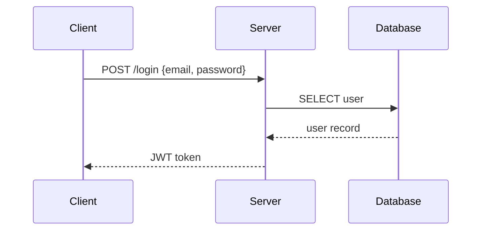
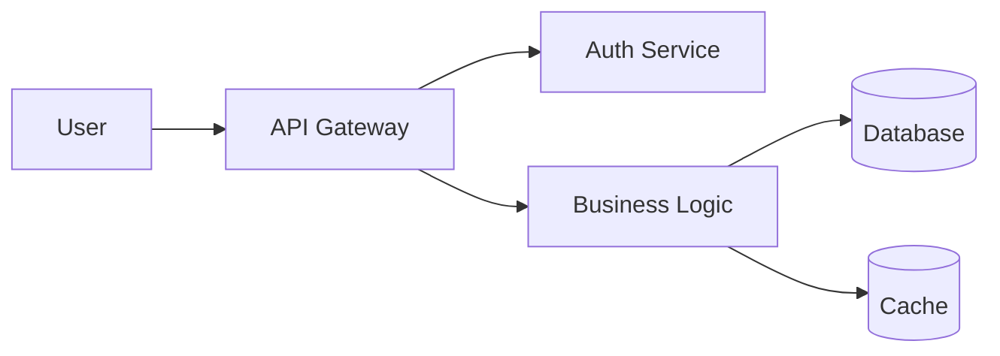
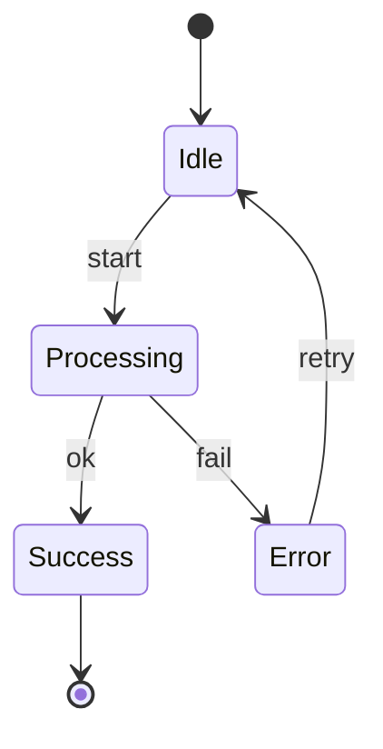

# Mermaid Diagrams

Generate `.mmd` text files and export to PNG/SVG/PDF using `mmdc` CLI or Kroki API.

**Key advantage:** Text-based syntax with fully automatic layout �no x/y coordinates needed.

## Prerequisites

**Option A: Local (mmdc)**
```bash
npm install -g @mermaid-js/mermaid-cli
npx puppeteer browsers install chrome-headless-shell
mmdc --version
```

**Option B: Kroki API (no install)**
```bash
curl --version  # Just need curl
```

## Workflow

1. Check deps �`mmdc --version` or fall back to Kroki
2. Pick diagram type from table below
3. Generate `.mmd` file
4. Validate syntax before export
5. Export to PNG/SVG/PDF
6. Show to user, iterate

## Validation (Required)
```bash
# With mmdc
mmdc -i diagram.mmd -o /tmp/test.png 2>&1

# With Kroki (if mmdc unavailable)
curl -s -X POST -H "Content-Type: text/plain" --data-binary @diagram.mmd https://kroki.io/mermaid/svg -o /tmp/test.svg && echo "Valid" || echo "Invalid"
```

## Diagram Types

| Type | Keyword | Use for |
|------|---------|---------|
| Flowchart | `flowchart TD/LR` | processes, pipelines, decisions |
| Sequence | `sequenceDiagram` | API calls, message passing |
| Class | `classDiagram` | OOP models, data structures |
| ER | `erDiagram` | database schemas |
| State | `stateDiagram-v2` | state machines, lifecycle |
| Gantt | `gantt` | project timelines |
| Pie | `pie` | proportions |
| Git Graph | `gitGraph` | branch strategies |
| Mind Map | `mindmap` | topic breakdowns |
| User Journey | `journey` | user-experience flows |

## Quick Examples

### Sequence Diagram (API Flow)


### Flowchart (Architecture)


### State Diagram


## Export
```bash
# Local
mmdc -i diagram.mmd -o diagram.png -w 1200

# Kroki (PNG)
curl -s -X POST -H "Content-Type: text/plain" --data-binary @diagram.mmd https://kroki.io/mermaid/png -o diagram.png

# Kroki (SVG)
curl -s -X POST -H "Content-Type: text/plain" --data-binary @diagram.mmd https://kroki.io/mermaid/svg -o diagram.svg
```

## Common Errors
- Missing quotes around labels with special characters �use `A["Label with spaces"]`
- Wrong arrow syntax �sequence uses `->>`, flowchart uses `-->`
- Undeclared participants in sequence diagrams �declare all participants first